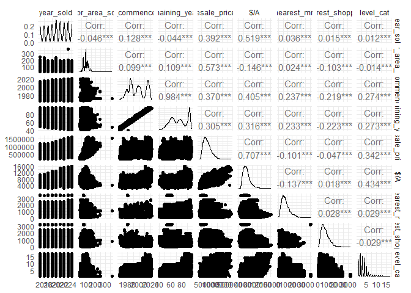

HDB Resale Prices Regression Analysis (2017-2025)
================
Greg Oh
2025-12-25

# HDB Resale Prices

In this project, we aim to identify and interpret factors that can
influence resale prices in HDBs from 2017 to 2025.

## Data Visuallisation

Using Tableau we can create a dashboard for Exploratory data analysis to
identify patterns and trends in the data. We can find the dashboard from
here in this link:
<https://public.tableau.com/app/profile/greg.oh3619/viz/HDBResaleDashboard2017-2025/Dashboard1>

Additionally, to get the coordinates of the we use the OneMap API. The
Python code can be found in the same repository.

## Regression Analysis

### Data Preperation

From the dash board, we notice that places closest to ameneties like
MRTs often have an increase in value. Thus, we will now create an
additional variable that calculates the straight line distance from the
HDB to the amenity.

#### Calculating Distance to Closest Amenities

Extract Coordinates from dataset.

``` r
hdb_coordinates = hdb_data %>% select(full_address,Longitude,Latitude)

head(hdb_coordinates)
```

    ## # A tibble: 6 × 3
    ##   full_address             Longitude        Latitude        
    ##   <chr>                    <chr>            <chr>           
    ## 1 406 ANG MO KIO AVENUE 10 103.853879910407 1.36200453938712
    ## 2 108 ANG MO KIO AVENUE 4  103.838201940326 1.37096635222625
    ## 3 602 ANG MO KIO AVENUE 5  103.835368226602 1.38070883044887
    ## 4 465 ANG MO KIO AVENUE 10 103.857200967235 1.3662010408294 
    ## 5 601 ANG MO KIO AVENUE 5  103.835131744823 1.38104134784496
    ## 6 150 ANG MO KIO AVENUE 5  103.842017962576 1.37680678506745

``` r
mrt_coordinates = read_excel('MRT Stations.xlsx') %>% select(STN_NAME,Longitude,Latitude) %>% filter(str_detect(STN_NAME,"MRT"))
```
``` r
head(mrt_coordinates)
```

    ## # A tibble: 6 × 3
    ##   STN_NAME                   Longitude Latitude
    ##   <chr>                          <dbl>    <dbl>
    ## 1 EUNOS MRT STATION               104.     1.32
    ## 2 CHINESE GARDEN MRT STATION      104.     1.34
    ## 3 KHATIB MRT STATION              104.     1.42
    ## 4 KRANJI MRT STATION              104.     1.43
    ## 5 REDHILL MRT STATION             104.     1.29
    ## 6 YEW TEE MRT STATION             104.     1.40

#### Distance to MRT
We will use the SF package for calculating the
minimum distance between a HDB and its respectivce coordinates. - CRS
4326 is standard GPS lat/lon.

``` r
houses_sf <- st_as_sf(hdb_coordinates, coords = c("Longitude", "Latitude"), crs = 4326)
stations_sf <- st_as_sf(mrt_coordinates, coords = c("Longitude", "Latitude"), crs = 4326)
```

We will find the nearest MRT Station (Index) then calculates the
distance to that specific nearest station

``` r
nearest_indices <- st_nearest_feature(houses_sf, stations_sf)
nearest_mrt <- st_distance(houses_sf, stations_sf[nearest_indices,], by_element = TRUE)

head(nearest_mrt)
```

    ## Units: [m]
    ## [1] 926.8996 197.4413 499.2857 880.4259 471.1541 639.4557

``` r
shopping_coordinates = read_excel('shopping_mall_coordinates.xlsx') %>% select(`Mall Name`,LONGITUDE,LATITUDE) %>%
  rename( Mall = `Mall Name`,
         Longitude = LONGITUDE,
         Latitude = LATITUDE)

head(shopping_coordinates)
```

    ## # A tibble: 6 × 3
    ##   Mall                           Longitude Latitude
    ##   <chr>                              <dbl>    <dbl>
    ## 1 100 AM                              104.     1.27
    ## 2 313@Somerset                        104.     1.30
    ## 3 Aperia                              104.     1.31
    ## 4 Balestier Hill Shopping Centre      104.     1.33
    ## 5 Bugis Cube                          104.     1.30
    ## 6 Bugis Junction                      104.     1.30

#### Distance to Shopping Center

We will use the SF package for calculating the minimum distance between
a HDB and its respectivce coordinates. - CRS 4326 is standard GPS
lat/lon.

``` r
shopping_sf <- st_as_sf(shopping_coordinates, coords = c("Longitude", "Latitude"), crs = 4326)
```

We will find the nearest Shopping Center (Index) then calculates the
distance to that specific nearest center

``` r
nearest_indices <- st_nearest_feature(houses_sf, shopping_sf)
nearest_shopping <- st_distance(houses_sf, shopping_sf[nearest_indices,], by_element = TRUE)

head(nearest_shopping)
```

    ## Units: [m]
    ## [1] 1006.2123  867.9784 1528.0225  892.9041 1571.9029  695.8329

We now add these new vectors to the original dataframe

``` r
hdb_data = cbind(hdb_data,nearest_mrt,nearest_shopping)
hdb_data = hdb_data[,1:20]

#Convert  Factors into numeric
hdb_data = hdb_data %>% mutate(remaining_years = as.numeric(remaining_years),
                               nearest_mrt = as.numeric(nearest_mrt),
                               nearest_shopping = as.numeric(nearest_shopping),
                               year_sold = as.numeric(year_sold))

level_function = function(x){
  level = x %>% substr(1,2) %>% as.numeric() 
  level = level %/% 3 +1
}

hdb_data$level_cat = sapply(hdb_data$storey_range,level_function)

head(hdb_data)
```

    ##   moNORTH year_sold moNORTH_sold       town flat_type block
    ## 1 2017-01      2017           01 ANG MO KIO    2 ROOM   406
    ## 2 2017-01      2017           01 ANG MO KIO    3 ROOM   108
    ## 3 2017-01      2017           01 ANG MO KIO    3 ROOM   602
    ## 4 2017-01      2017           01 ANG MO KIO    3 ROOM   465
    ## 5 2017-01      2017           01 ANG MO KIO    3 ROOM   601
    ## 6 2017-01      2017           01 ANG MO KIO    3 ROOM   150
    ##            street_name storey_range floor_area_sqm     flat_model
    ## 1 ANG MO KIO AVENUE 10     10 TO 12             44       Improved
    ## 2  ANG MO KIO AVENUE 4     01 TO 03             67 New Generation
    ## 3  ANG MO KIO AVENUE 5     01 TO 03             67 New Generation
    ## 4 ANG MO KIO AVENUE 10     04 TO 06             68 New Generation
    ## 5  ANG MO KIO AVENUE 5     01 TO 03             67 New Generation
    ## 6  ANG MO KIO AVENUE 5     01 TO 03             68 New Generation
    ##   lease_commence_date    remaining_lease remaining_years resale_price
    ## 1                1979 61 years 04 months              61       232000
    ## 2                1978 60 years 07 months              60       250000
    ## 3                1980 62 years 05 months              62       262000
    ## 4                1980  62 years 01 month              62       265000
    ## 5                1980 62 years 05 months              62       265000
    ## 6                1981           63 years              63       275000
    ##               full_address         Latitude        Longitude      $/A
    ## 1 406 ANG MO KIO AVENUE 10 1.36200453938712 103.853879910407 5272.727
    ## 2  108 ANG MO KIO AVENUE 4 1.37096635222625 103.838201940326 3731.343
    ## 3  602 ANG MO KIO AVENUE 5 1.38070883044887 103.835368226602 3910.448
    ## 4 465 ANG MO KIO AVENUE 10  1.3662010408294 103.857200967235 3897.059
    ## 5  601 ANG MO KIO AVENUE 5 1.38104134784496 103.835131744823 3955.224
    ## 6  150 ANG MO KIO AVENUE 5 1.37680678506745 103.842017962576 4044.118
    ##   nearest_mrt nearest_shopping level_cat
    ## 1    926.8996        1006.2123         4
    ## 2    197.4413         867.9784         1
    ## 3    499.2857        1528.0225         1
    ## 4    880.4259         892.9041         2
    ## 5    471.1541        1571.9029         1
    ## 6    639.4557         695.8329         1

#### Exploratory data analysis

``` r
hdb_data %>% 
  select(where(is.numeric)) %>%
  ggpairs(progress = F) + theme_minimal()
```

<!-- -->

``` r
hdb_data %>%
  select(where(is.numeric)) %>%
  cor(use = "pairwise.complete.obs") %>%
  ggcorrplot(lab = FALSE, hc.order = TRUE, method = "square") +
  theme_minimal() + xlab("") + ylab("")
```
<!-- -->

Excluding the lease commence date and Cost/Area (\$/A) we notice that
the greatest factor in influencing resale price is the floor area.

Surprisingly, the distance to ameneties like MRT stations and Shopping
Centeres have a lower correlation coefficient compared to the other
numeric variables.

#### Linear Regression

We will now create a regresison model to quantify and predict the resale
price of a HDB

First, we will include numeric variables ‘remaining_years’,
‘floor_area_sqm’, ‘nearest_mrt’, ‘nearest_shopping’ and ‘year_sold’ to
predict ‘resale price’.

``` r
mlr <- lm(formula = resale_price ~ remaining_years + floor_area_sqm + nearest_mrt + nearest_shopping + year_sold + level_cat,
          data = hdb_data)
summary(mlr)
```

    ## 
    ## Call:
    ## lm(formula = resale_price ~ remaining_years + floor_area_sqm + 
    ##     nearest_mrt + nearest_shopping + year_sold + level_cat, data = hdb_data)
    ## 
    ## Residuals:
    ##     Min      1Q  Median      3Q     Max 
    ## -480994  -66904  -16282   47310  746018 
    ## 
    ## Coefficients:
    ##                    Estimate Std. Error t value Pr(>|t|)    
    ## (Intercept)      -6.505e+07  1.781e+05 -365.32   <2e-16 ***
    ## remaining_years   3.205e+03  1.711e+01  187.29   <2e-16 ***
    ## floor_area_sqm    4.513e+03  9.255e+00  487.58   <2e-16 ***
    ## nearest_mrt      -8.311e+01  5.130e-01 -162.01   <2e-16 ***
    ## nearest_shopping  3.685e+01  5.954e-01   61.89   <2e-16 ***
    ## year_sold         3.209e+04  8.806e+01  364.38   <2e-16 ***
    ## level_cat         2.685e+04  1.157e+02  232.00   <2e-16 ***
    ## ---
    ## Signif. codes:  0 '***' 0.001 '**' 0.01 '*' 0.05 '.' 0.1 ' ' 1
    ## 
    ## Residual standard error: 103300 on 220590 degrees of freedom
    ## Multiple R-squared:  0.692,  Adjusted R-squared:  0.692 
    ## F-statistic: 8.259e+04 on 6 and 220590 DF,  p-value: < 2.2e-16

From the F-Test we notice that the Regression Model is significant.
Additionally, from the individual T-tests, we reject the hypothesis that
the coefficients are equal to 0.

Now, we will check the Q-Q Plot to check for any violations of
assumptions.

``` r
qqnorm(residuals(mlr),ylab = 'Residuals')
qqline(residuals(mlr))
```

<!-- -->
Clearly, the normality assumption was violated.

We now check residual plots to check if more assumptions were violated.

``` r
par(mfrow=c(2,2))
plot(residuals(mlr), ylab='Residuals')
lines(lowess(residuals(mlr)), col = "red")

plot(fitted(mlr), residuals(mlr), ylab='Residuals', xlab='Fitted values')
lines(lowess(fitted(mlr), residuals(mlr)), col = "red")

plot(hdb_data$remaining_years, residuals(mlr), ylab='Residuals',xlab='Remaining Years')
lines(lowess(hdb_data$remaining_years, residuals(mlr)), col = "red")

plot(hdb_data$year_sold, residuals(mlr), ylab='Residuals',xlab='Year Sold')
lines(lowess(hdb_data$year_sold, residuals(mlr)), col = "red")
```

<!-- -->

``` r
par(mfrow=c(2,2))
plot(hdb_data$floor_area_sqm, residuals(mlr), ylab='Residuals',xlab='Floor Area')
lines(lowess(hdb_data$floor_area_sqm, residuals(mlr)), col = "red")

plot(hdb_data$nearest_mrt, residuals(mlr), ylab='Residuals',xlab='Distance to MRT')
lines(lowess(hdb_data$nearest_mrt, residuals(mlr)), col = "red") 

plot(hdb_data$nearest_shopping, residuals(mlr), ylab='Residuals',xlab='Distance to Shopping Center')
lines(lowess(hdb_data$nearest_shopping, residuals(mlr)), col = "red") 

plot(hdb_data$level_cat, residuals(mlr), ylab='Residuals',xlab='Floor Level')
lines(lowess(hdb_data$level_cat, residuals(mlr)), col = "red") 
```

<!-- --> From
the residual plots, we can see that the variance of the residuals
against Fitted Values and Floor Area do not have a constant variance.
This can be seen from the conical shape of the plot.

From the Q-Q Plot, the distribution of the quantiles have a heavy right
tail. Additionally, the distibution of resale prices shows a
right-skewed distribution. Thus, we will apply a log-transformation to
the model.

\#New Model

``` r
mlr2 <- lm(formula = log(resale_price) ~ remaining_years + floor_area_sqm + nearest_mrt + nearest_shopping + year_sold + level_cat,
          data = hdb_data)
summary(mlr2)
```

    ## 
    ## Call:
    ## lm(formula = log(resale_price) ~ remaining_years + floor_area_sqm + 
    ##     nearest_mrt + nearest_shopping + year_sold + level_cat, data = hdb_data)
    ## 
    ## Residuals:
    ##      Min       1Q   Median       3Q      Max 
    ## -1.33767 -0.11293 -0.01889  0.09311  1.14393 
    ## 
    ## Coefficients:
    ##                    Estimate Std. Error t value Pr(>|t|)    
    ## (Intercept)      -1.154e+02  2.967e-01 -388.92   <2e-16 ***
    ## remaining_years   6.831e-03  2.851e-05  239.58   <2e-16 ***
    ## floor_area_sqm    8.966e-03  1.542e-05  581.41   <2e-16 ***
    ## nearest_mrt      -1.425e-04  8.548e-07 -166.71   <2e-16 ***
    ## nearest_shopping  5.507e-05  9.921e-07   55.51   <2e-16 ***
    ## year_sold         6.286e-02  1.467e-04  428.45   <2e-16 ***
    ## level_cat         4.344e-02  1.929e-04  225.25   <2e-16 ***
    ## ---
    ## Signif. codes:  0 '***' 0.001 '**' 0.01 '*' 0.05 '.' 0.1 ' ' 1
    ## 
    ## Residual standard error: 0.1721 on 220590 degrees of freedom
    ## Multiple R-squared:  0.7535, Adjusted R-squared:  0.7534 
    ## F-statistic: 1.124e+05 on 6 and 220590 DF,  p-value: < 2.2e-16

The F-test and the T-tests show that the model is significant.

``` r
qqnorm(residuals(mlr2),ylab = 'Residuals')
qqline(residuals(mlr2))
```

<!-- -->

``` r
par(mfrow=c(2,2))
plot(residuals(mlr2), ylab='Residuals')
lines(lowess(residuals(mlr2)), col = "red")

plot(fitted(mlr2), residuals(mlr2), ylab='Residuals', xlab='Fitted values')
lines(lowess(fitted(mlr2), residuals(mlr2)), col = "red")

plot(hdb_data$remaining_years, residuals(mlr2), ylab='Residuals',xlab='Remaining Years')
lines(lowess(hdb_data$remaining_years, residuals(mlr2)), col = "red")

plot(hdb_data$year_sold, residuals(mlr2), ylab='Residuals',xlab='Year Sold')
lines(lowess(hdb_data$year_sold, residuals(mlr2)), col = "red")
```

<!-- -->

``` r
par(mfrow=c(2,2))
plot(hdb_data$floor_area_sqm, residuals(mlr2), ylab='Residuals',xlab='Floor Area')
lines(lowess(hdb_data$floor_area_sqm, residuals(mlr2)), col = "red")

plot(hdb_data$nearest_mrt, residuals(mlr2), ylab='Residuals',xlab='Distance to MRT')
lines(lowess(hdb_data$nearest_mrt, residuals(mlr2)), col = "red") 

plot(hdb_data$nearest_shopping, residuals(mlr2), ylab='Residuals',xlab='Distance to Shopping Center')
lines(lowess(hdb_data$nearest_shopping, residuals(mlr2)), col = "red")

plot(hdb_data$level_cat, residuals(mlr2), ylab='Residuals',xlab='Floor Level')
lines(lowess(hdb_data$level_cat, residuals(mlr2)), col = "red") 
```

<!-- --> From
the Q-Q Plot, the heavy right tail of the plot has been greatly reduced.
Additionally, the residual plots mostly show a horizontal band. Overall,
the assumptions of the model are mostly followed and we will be using
this model for interpretation.

#### Interpretation and Conclusion

From the model, we get the following equation.
$$
\begin{aligned}
\ln(\widehat{\text{Resale Price}}) = &-115.4 \\
&+ 0.00683(\text{Remaining\_Years}) \\
&+ 0.00897(\text{Floor\_Area\_sqm}) \\
&- 0.000143(\text{Nearest\_MRT}) \\
&+ 0.000055(\text{Nearest\_Shopping}) \\
&+ 0.0629(\text{Year\_Sold}) \\
&+ 0.0434(\text{Level\_Cat})
\end{aligned}
$$

Overall, we can identify the effects of each variable

``` r
percentage_change = round(((exp(mlr2$coefficients) - 1) *100),3)[2:7]
as.data.frame(percentage_change)
```

    ##                  percentage_change
    ## remaining_years              0.685
    ## floor_area_sqm               0.901
    ## nearest_mrt                 -0.014
    ## nearest_shopping             0.006
    ## year_sold                    6.488
    ## level_cat                    4.440

For a sanity check lets create a hypothetical “HDB Flat” on the
“remaining_years” variable

``` r
new_house <- data.frame(
  remaining_years = 90,
  floor_area_sqm = 100,
  nearest_mrt = 500,
  nearest_shopping = 500,
  year_sold = 2025,
  level_cat = 10
)

new_house2 <- data.frame(
  remaining_years = 91,
  floor_area_sqm = 100,
  nearest_mrt = 500,
  nearest_shopping = 500,
  year_sold = 2025,
  level_cat = 10
)

predicted_price <- exp(predict(mlr2, newdata = new_house))

predicted_price2 <- exp(predict(mlr2, newdata = new_house2))

#Percent change
((predicted_price2 - predicted_price)/predicted_price) * 100
```

    ##         1 
    ## 0.6854821

The coefficients for “nearest_mrt” and “nearest_shopping” seem
relatively small. However, it is because it is in Metres instead of
kilometres.

Additionally, the “level_cat” variable was based on “storey_range” where
HDB units were categorised into ranges of 3 fot their levels. Hence, the
coefficient may seem large.

The appropriate coefficients are as follows.

``` r
percentage_change = as.data.frame(percentage_change)

#From Metres to Kilometres (Nearest MRT)
percentage_change[3,] = percentage_change[3,] * 1000

#From Metres to Kilometres (Nearest Shopping)
percentage_change[4,] = percentage_change[4,] * 1000

#From every 3 floors to just 1 floor each
percentage_change[6,] = percentage_change[6,] /3

percentage_change
```

    ##                  percentage_change
    ## remaining_years              0.685
    ## floor_area_sqm               0.901
    ## nearest_mrt                -14.000
    ## nearest_shopping             6.000
    ## year_sold                    6.488
    ## level_cat                    1.480

Overall, we can conclude that a properties price is mostly affected by
how close it is to certain ammenities especially MRTs. Where, for every
kilometre closer to the MRT, the value of the property increases by
about 14%.

Additionally, a properties value also increases by about 6.5% every
year, which seems about right due to factors like inflation etc.


